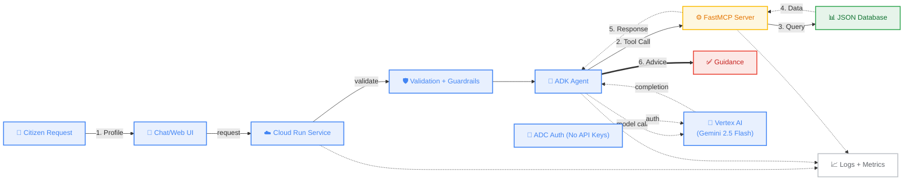

# SmartApply AI

SmartApply AI is a comprehensive AI-powered application that seamlessly analyzes user profiles against various government schemes and public assistance programs to determine eligibility and recommend the best options.

Built for seamless performance, it leverages an uncoupled architecture linking the **Google Agent Development Kit (ADK)** with standard datasets via **Model Context Protocol (MCP)**. Everything runs locally inside Docker, but it is fundamentally designed for robust cloud deployment on **Google Cloud Run**.

---

## Architecture



1. **MCP Server (`mcp_main.py`)**: Built with FastMCP to expose a structured scheme catalog (`database.json`) over MCP tools.
2. **ADK Agent (`smartapply_agent/agent.py`)**: A Google ADK `LlmAgent` running `gemini-2.5-flash` (Vertex AI) and calling MCP tools over stdio.

---

## Quickstart (Local)

1. Make sure Python 3.11 is installed.
2. Install dependencies:
   ```bash
   cd smartapply_ai
   pip install -r requirements.txt
   ```
3. Authenticate with Google Cloud (ADC):
   ```bash
   gcloud auth application-default login
   ```
4. Set Vertex AI env vars (copy `.env.example` to `.env` or export env vars):
   ```env
   GOOGLE_GENAI_USE_VERTEXAI=TRUE
   GOOGLE_CLOUD_PROJECT=your-gcp-project-id
   GOOGLE_CLOUD_LOCATION=us-central1
   ```
5. Run ADK Dev UI:
   ```bash
   adk web
   ```

---

## Google Cloud Run Deployment

### Build + Deploy (same pattern as NextMove)

```bash
gcloud services enable aiplatform.googleapis.com run.googleapis.com cloudbuild.googleapis.com artifactregistry.googleapis.com
gcloud builds submit --tag gcr.io/YOUR_PROJECT_ID/smartapply-ai
gcloud run deploy smartapply-ai \
  --image gcr.io/YOUR_PROJECT_ID/smartapply-ai \
  --region us-central1 \
  --platform managed \
  --allow-unauthenticated \
  --set-env-vars="GOOGLE_GENAI_USE_VERTEXAI=TRUE,GOOGLE_CLOUD_PROJECT=YOUR_PROJECT_ID,GOOGLE_CLOUD_LOCATION=us-central1" \
  --memory=1Gi \
  --timeout=300
```

### Get the Cloud Run URL (one-liner)

```bash
gcloud run services describe smartapply-ai --region us-central1 --format="value(status.url)"
```
