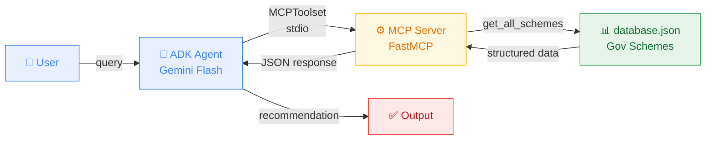

# SmartApply AI

SmartApply AI is a comprehensive AI-powered application that seamlessly analyzes user profiles against various government schemes and public assistance programs to determine eligibility and recommend the best options.

Built for seamless performance, it leverages an uncoupled architecture linking the **Google Agent Development Kit (ADK)** with standard datasets via **Model Context Protocol (MCP)**. Everything runs locally inside Docker, but it is fundamentally designed for robust cloud deployment on **Google Cloud Run**.

---

## Architecture



1. **MCP Server (`app/mcp_service/mcp_main.py`)**: Built with FastMCP to expose JSON mock records of government schemes securely over standard input/output.
2. **ADK Agent (`app/ai_agent/eligibility_agent.py`)**: The orchestration layer. A Google `LlmAgent` runs on `gemini-2.5-flash` (via Vertex AI). It binds dynamically to the MCP Server, queries the user's eligibility, processes the logic, and returns a rich summary.

---

## Quickstart (Local)

1. Make sure Python 3.11 is installed.
2. Clone/open the repo and navigate into `smartapply_ai`.
3. Create a virtual environment and load requirements:
   ```bash
   pip install -r requirements.txt
   ```
4. Authenticate with Google Cloud using your Lab ID/Project:
   ```bash
   gcloud auth application-default login
   ```
5. Ensure your `.env` contains the required Vertex AI setup:
   ```env
   GOOGLE_GENAI_USE_VERTEXAI=TRUE
   GOOGLE_CLOUD_PROJECT=your-google-lab-project-id
   GOOGLE_CLOUD_LOCATION=us-central1
   ```
6. Run the agent:
   ```bash
   python app/ai_agent/eligibility_agent.py
   ```

---

## Google Cloud Run Deployment

Deploy your SmartApply AI agent instantly with zero local Docker build permissions using Google Cloud Run sourced deployments!

### Prerequisites:

- Check that the `gcloud` CLI is installed and authenticated.

### Deployment Steps:

1. **Navigate to the app root**

   ```bash
   cd c:\MySpace\Projects\GenAI\smartapply_ai
   ```

2. **Deploy effortlessly**
   We leverage `--source .` so Cloud Build compiles everything directly in the cloud, utilizing Vertex AI configuration automatically!
   ```bash
   gcloud run deploy smartapply-ai-service \
     --source . \
     --region us-central1 \
     --set-env-vars GOOGLE_GENAI_USE_VERTEXAI=TRUE,GOOGLE_CLOUD_PROJECT=YOUR_PROJECT_ID,GOOGLE_CLOUD_LOCATION=us-central1 \
     --allow-unauthenticated
   ```
